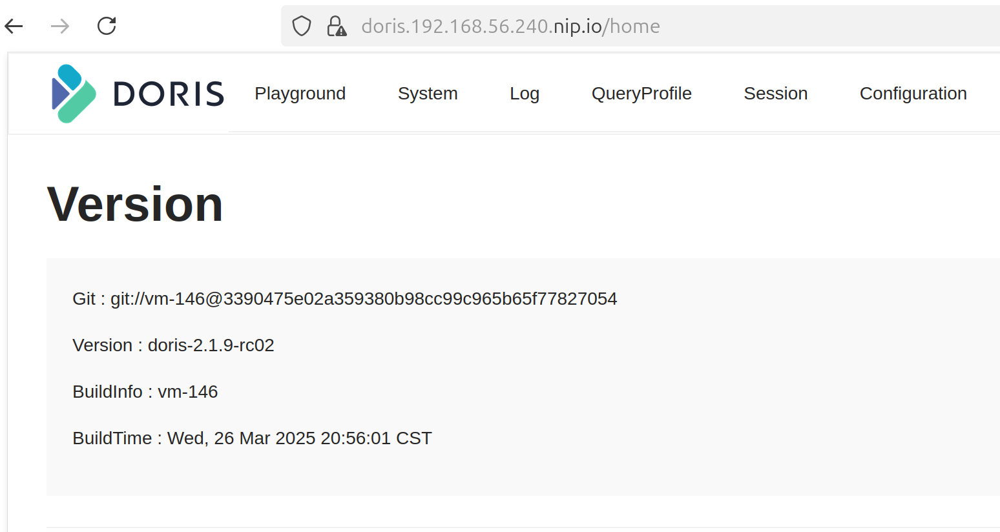

# vagrant-k8s calico
This repo spins up a k8s cluster with calico on VirtualBox vms using vagrant. Local setup with vagrant helps debug k8s deployments with self-signed or staging tls certificates which require full access to nodes and updates to containerd (and are no longer feasible on Digitalocean, for example - no ssh access, managed LoadBalancer will only mount production tls and no containerd update even via deployment spec). 
The repo deploys cert-manager, metallb, gitea (light-weight alternative to gitlab for CI/CD) and Doris cluster with self-signed certs. Your app deployment part is up to you (might require even more CPU - 16+ cores and RAM - 64GB+ and an additional worker node). 
It is tested for kubernetes 1.32 version and should work with newer versions, although some yaml definitions might need to be adjusted. The repo should work on any amd64 machine running Debian linux with sufficient resources (tweak CPU and RAM node settings in Vagrantfile). It has not been tested with kvm-libvirt hypervisor and switching to cilium cni plugin will most likely fail with VirtualBox. 
Repo structure is flat for ease of navigation and the code is only suitable for local development (not for deployment on publicly-accessable infra).

## To start
```
vagrant up
# only needed once
VBoxManage hostonlyif create
VBoxManage hostonlyif ipconfig vboxnet0 --ip 192.168.56.1

# once k8s deployed - fetch kube config !!!
vagrant ssh master -- sudo cat /etc/kubernetes/admin.conf > ~/.kube/config

# check
kubectl get pods -n kube-system -l k8s-app=calico-node -o wide
# test with ngnix 
kubectl create deploy nginx --image=nginx
kubectl expose deploy nginx --port=80
kubectl get pods,svc
```
# add this networks config if vagrant fails with: "The IP address configured for the host-only network is not within the allowed ranges." 
# IP should match settings in the config.env file
```
echo "* 10.1.10.0/24 192.168.56.0/21" | sudo tee /etc/vbox/networks.conf
```
# and disable KVM extensions on AMD (non intel) boxes
```
sudo systemctl stop libvirtd
sudo rmmod kvm_amd
sudo rmmod kvm

# to blacklist (optional):
echo "blacklist kvm_amd" | sudo tee /etc/modprobe.d/blacklist-kvm.conf
echo "blacklist kvm"     | sudo tee -a /etc/modprobe.d/blacklist-kvm.conf
```
## Requirements
- virtualbox-7.0
- vagrant
- helm
- ansible
- docker

### Install requirements

- virtualbox-7.0
```
wget -q https://www.virtualbox.org/download/oracle_vbox_2016.asc -O- | sudo apt-key add -
wget -q https://www.virtualbox.org/download/oracle_vbox.asc -O- | sudo apt-key add -
sudo add-apt-repository "deb [arch=amd64] http://download.virtualbox.org/virtualbox/debian $(lsb_release -cs) contrib"
sudo apt update
sudo apt install virtualbox-7.0
```

- vagrant
```
wget -O- https://apt.releases.hashicorp.com/gpg | gpg --dearmor | sudo tee /usr/share/keyrings/hashicorp-archive-keyring.gpg
echo "deb [signed-by=/usr/share/keyrings/hashicorp-archive-keyring.gpg] https://apt.releases.hashicorp.com $(lsb_release -cs) main" | sudo tee /etc/apt/sources.list.d/hashicorp.list
sudo apt update && sudo apt install vagrant
```

- ansible
# activate ansible virtual environment and install ansible and kubernetes packages. 
```
    sudo apt install ansible
    python3 -m venv ~/ansible-env
    source ~/ansible-env/bin/activate
    pip install kubernetes jmespath
```
# deploy certmanager and MetalLB
```
ansible-playbook deploy-certmanager.yml
# then check 
kubectl get all -n cert-manager
kubectl get all -n metallb-system
```
# make sure env variables required for s3 access are exported as gitea uses AWS s3 for storage in this setup. Digitalocean's own implementation of cloud storage is not s3 compatible
```
export AWS_ACCESS_KEY_ID="...."
export AWS_SECRET_ACCESS_KEY="...."

# additional variables are set in deploy-gitea.yml. 
S3_BUCKET="...."
S3_REGION="...."
S3_ENDPOINT="...."
```
# deploy gitea
```
ansible-playbook deploy-gitea.yml
```
# push images to https://192.168.56.240.nip.io org: doris, repo: doris
```
export GITEA_ROOT_PASSWORD='Gitea_YourSecurePassword'
# make sure 192.168.56.240.nip.io is added to insecure hosts in /etc/hosts as it uses self-signed cert
{
  "insecure-registries": ["192.168.56.240.nip.io", "doris.192.168.56.240.nip.io"]
}
# then extract the cert
kubectl get secret 192.168.56.240.nip.io-tls -n gitea -o jsonpath='{.data.tls\.crt}' | base64 -d > gitea.crt
# copy gitea.crt to docker
sudo mkdir -p /etc/docker/certs.d/192.168.56.240.nip.io
sudo cp gitea.crt /etc/docker/certs.d/192.168.56.240.nip.io/gitea.crt
sudo systemctl restart docker
kubectl get secret doris.192.168.56.240.nip.io-tls -n doris -o jsonpath='{.data.tls\.crt}' | base64 -d > doris.crt
# copy doris.crt to docker
sudo mkdir -p /etc/docker/certs.d/doris.192.168.56.240.nip.io
sudo cp doris.crt /etc/docker/certs.d/doris.192.168.56.240.nip.io/doris.crt
sudo systemctl restart docker
# copy self-signed certs over to the nodes and restart containerd by running
./update-containerd.sh gitea.crt 192.168.56.240.nip.io
./update-containerd.sh doris.crt doris.192.168.56.240.nip.io

# wait for all gitea pods to restart and then test login
echo "$GITEA_ROOT_PASSWORD" | docker login https://192.168.56.240.nip.io -u Gitea_Admin --password-stdin
# or
docker login https://192.168.56.240.nip.io -u Gitea_Admin -p "$GITEA_ROOT_PASSWORD"

docker tag your_app:latest 192.168.56.240.nip.io/your_app/your_app:main
```
# to deploy your-app
```
# make sure to create group - your_app and repo your_app in gitea UI first (accessable at https://192.168.56.240.nip.io). Since the certs are self-signed you should accept browser warning and "accept and proceed" anyway.
docker push 192.168.56.240.nip.io/your_app/your_app:main
```
# to debug
```
kubectl run debug-pod --rm -it \
  --image=192.168.56.240.nip.io/your_app/your_app:main \
  --namespace=your_app \
  -- /bin/bash

# and something along this line if using a python app
/usr/local/bin/python -m your_app
```
# deploy doris with yaml definitions - requires a local machine with 16 cores and 64GB+ memory
```
# pre requisite
sudo sysctl -w vm.max_map_count=2000000
# deploy doris
ansible-playbook deploy-doris.yml
```
# wait for fe and be pods to ramp up - then to check
```
kubectl exec -it -n doris doris-cluster-fe-0 -- bash
mysql -h 127.0.0.1 -P 9030 -u root
SHOW BACKENDS\G
# to run DBT jobs either port-forward to local machine or push DBT image to gitea and then deploy DBT pod

# and if the tls setup was correct doris UI (service port 8030) should be accessable over https://doris.192.168.56.240.nip.io with login user name - root and an empty password by default
```


# to clean-up
```
# under project root dir
vagrant destroy -f
```